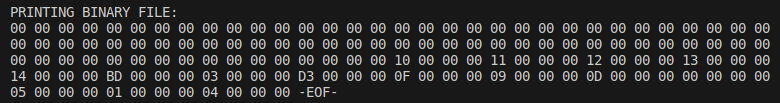

# 2023-2-CC4102-LOGARITMOS

Me tomé la libertad de agregar más funcionalidad al código de la tarea. De ahí que hay nuevos conceptos que necesito que entiendan para usar el código.

+ ### Archivo binario: file.bin 
    El archivo binario se ve de la siguiente forma:
    

    Cada número que agregamos al archivo binario aparece aquí como hex en 4 pares de 2 dígitos.

    ```4 bytes -> 32 bits -> 8 hex``` 
    
    Lo que sí, están representados en little-endian, es decir que:

    ```1 (dec) -> 00 00 00 01 (big) -> 01 00 00 00 (lil)```

    ```10 (dec) -> 00 00 00 10 (big) -> 10 00 00 00 (lil)```

    ```1100 (dec) -> 00 00 04 4C (big) -> 4C 04 00 00 (lil)```
    
    etc. Esto no afecta su valor en decimal, eso sí.

    Lo que es importante, es que cada usuario define y tiene que tener bien claro cuál es el tamaño de los nodos del R-tree, porque en la archivo binario no se añade ninguna clase de chequeo, y no existen los caracteres `\n` (newline). Antes habíamos convenido que cada nodo estaría delimitado por `\n` (newline), pero como esto ya no es posible, recomiendo tener las siguientes constantes en el programa:

    ```const int REF= 20 // esto es una constante.```
    
    La referencia de un solo nodo tiene que ser mínimo de 20 bytes, pues contiene 5 enteros de 4 bytes: `{x1, y1, x2, y2, l}`. Con `x` e `y` las coordenadas del rectángulo y `l` la *línea* del archivo binario en el que se almacena el nodo hijo con dichas coordenadas... ***¿Qué ocurre cuándo un nodo no tiene hijos?***
    
    ```const int NODE_SIZE_BYTES= 80 * REF```

    Un nodo, en este ejemplo, contiene 80 de estas referencias. 
    
    ***AJUSTAR SABIENDO LAS CAPACIDADES DE SU COMPUTADOR. UNA PÁGINA DE DISCO ES DE GENERALMENTE 4KB. POR ENUNCIADO, NO ES RECOMENDABLE QUE ESTE NÚMERO SEA MAYOR A ESO.*** 
    
    Como cada nodo del R-tree almacena (generalmente) exactamente M hijos, entonces podemos decir que para extraer el nodo en la *línea* K del archivo binario, llamamos a:
    
    ```struct Node* node_k= x_get(filename, K * NODE_SIZE_BYTES, NODE_SIZE_BYTES)```

    ***¿Qué ocurre en los casos borde, como cuando un nodo tiene menos de M hijos?***

    ***¡¡¡ESTO ES SÚPER IMPORTANTE QUE LO TENGAN CLARO!!!***

+ ### x_write
    Escribe datos al disco. Ver el código para saber como funciona.

+ ### x_get2
    En el código de la tarea ya viene definida una estructura `Node`, que almacena 5 valores `{x1, y1, x2, y2, l}`. A diferencia de `x_get`, esta función lee el archivo binario y retorna un array de `Node`s. Esto facilita el uso de la función `compare_nodes`, que compara los valores de 2 `Node`s y se puede utiliar en `qsort`. ***NO OLVIDAR LIBERAR LA MEMORIA UTILIZADA CON*** `free` ***LUEGO DE UTILIZAR ESTA FUNCIÓN.***

+ ### qsort
    Esta función es útil para ordenar cosas que no tienen orden natural. Toma 4 parámetros: ```void* __base, size_t __nmemb, size_t __size, __compar_fn_t __compar```. 
    
    Ordena `__nmemb` elementos de `__base` de tamaño `__size`, por comparaciones según la función `__compar`.